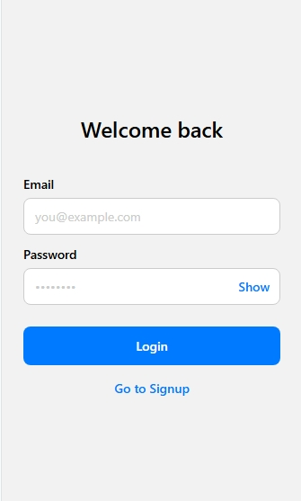
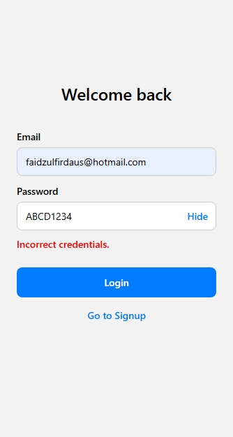
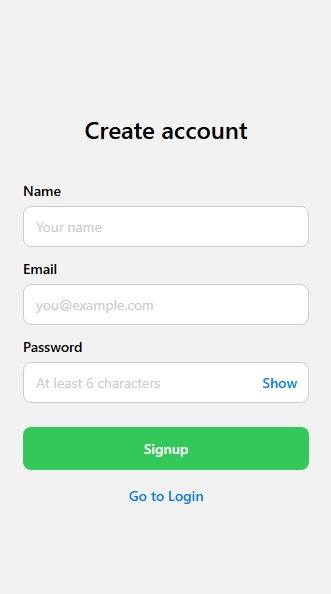
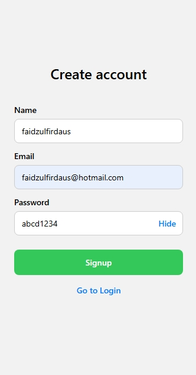
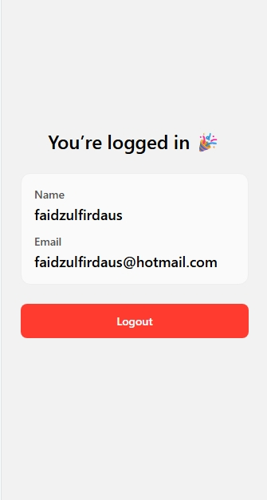

# USER AUTHENTICATION APP

## Requirements
- Node.js >= 16
- Expo CLI

## Overview
A simple React Native authentication flow using React Context API, React Navigation, and AsyncStorage. Built entirely online in Expo Snack.

## Features
- Login, Signup, and Home screens
- Context-based auth: login, signup, logout, user state
- Validations: email format, password length, required fields
- Error messages and clean UI
- Save login session with AsyncStorage
- Password visibility toggle

## Tech
- Expo + React Native
- @react-navigation/native, @react-navigation/native-stack
- @react-native-async-storage/async-storage

## Getting Started
1. Download ZIP or clone repository.
2. Install dependencies:
   - npm install
3. Run locally:
   - npx expo start
  
## Usage
1. Open the app.
2. Create a new account via Signup.
3. Login with your credentials.
4. View your profile on the Home screen.
5. Logout to return to Login.

## Live Demo
Try it on [Expo Snack](https://snack.expo.dev/@mffm92/user-authentication-app)

## Screenshots

## Notes
This demo uses an in-memory user store for demonstration. Replace with a backend for production use.
